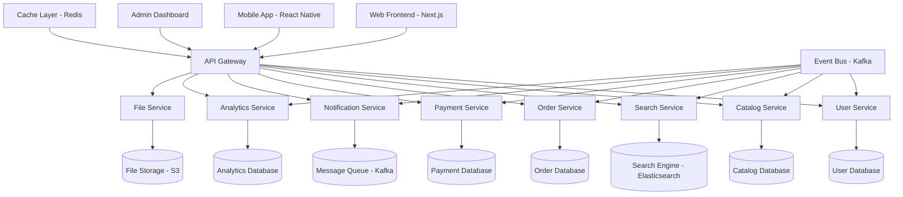

# Microservices Architecture for Production B2B Marketplace

## 🏗️ High-Level Architecture Overview



## 📦 Recommended Project Structure (Production)

### 1. Monorepo Structure

```bash
B2B-Marketplace-Platform/
├── apps/                          # Application layer
│   ├── web/                       # Next.js frontend
│   │   ├── src/
│   │   ├── package.json
│   │   └── next.config.js
│   ├── mobile/                    # React Native app
│   │   ├── src/
│   │   ├── android/
│   │   ├── ios/
│   │   └── package.json
│   ├── admin/                     # Admin dashboard
│   │   ├── src/
│   │   └── package.json
│   └── api-gateway/               # API orchestration
│       ├── src/
│       ├── routes/
│       └── middleware/

├── services/                      # Microservices
│   ├── user-service/
│   │   ├── src/
│   │   │   ├── controllers/
│   │   │   ├── models/
│   │   │   ├── services/
│   │   │   └── utils/
│   │   ├── tests/
│   │   ├── Dockerfile
│   │   └── package.json
│   ├── catalog-service/
│   ├── search-service/
│   ├── order-service/
│   ├── payment-service/
│   ├── notification-service/
│   ├── analytics-service/
│   └── file-service/

├── packages/                      # Shared libraries
│   ├── ui/                        # Shared UI components
│   │   ├── src/
│   │   │   ├── components/
│   │   │   ├── hooks/
│   │   │   └── utils/
│   │   └── package.json
│   ├── types/                     # TypeScript definitions
│   │   ├── src/
│   │   │   ├── api/
│   │   │   ├── database/
│   │   │   └── common/
│   │   └── package.json
│   ├── utils/                     # Shared utilities
│   │   ├── src/
│   │   │   ├── validation/
│   │   │   ├── formatting/
│   │   │   └── helpers/
│   │   └── package.json
│   ├── config/                    # Configuration
│   │   ├── database/
│   │   ├── cache/
│   │   └── messaging/
│   └── testing/                   # Testing utilities
│       ├── fixtures/
│       ├── mocks/
│       └── helpers/

├── infrastructure/                # Infrastructure as Code
│   ├── docker/
│   │   ├── development/
│   │   │   └── docker-compose.yml
│   │   └── production/
│   │       ├── Dockerfile.web
│   │       ├── Dockerfile.api
│   │       └── docker-compose.prod.yml
│   ├── kubernetes/
│   │   ├── namespaces/
│   │   ├── deployments/
│   │   ├── services/
│   │   ├── ingress/
│   │   └── configmaps/
│   ├── terraform/
│   │   ├── aws/
│   │   ├── gcp/
│   │   └── modules/
│   └── monitoring/
│       ├── prometheus/
│       ├── grafana/
│       └── alertmanager/

├── docs/                          # Documentation
│   ├── api/
│   ├── architecture/
│   ├── deployment/
│   └── user-guides/

├── scripts/                       # Automation scripts
│   ├── build/
│   ├── deploy/
│   ├── database/
│   └── testing/

├── .github/                       # CI/CD workflows
│   ├── workflows/
│   └── templates/

└── package.json                   # Root package.json
```

## 🔧 Individual Microservice Architecture

### 1. User Service

```typescript
// User Service Structure
user-service/
├── src/
│   ├── controllers/
│   │   ├── auth.controller.ts
│   │   ├── profile.controller.ts
│   │   └── admin.controller.ts
│   ├── models/
│   │   ├── user.model.ts
│   │   ├── role.model.ts
│   │   └── session.model.ts
│   ├── services/
│   │   ├── auth.service.ts
│   │   ├── user.service.ts
│   │   ├── notification.service.ts
│   │   └── audit.service.ts
│   ├── middleware/
│   │   ├── auth.middleware.ts
│   │   ├── validation.middleware.ts
│   │   └── rate-limit.middleware.ts
│   ├── routes/
│   │   ├── auth.routes.ts
│   │   ├── user.routes.ts
│   │   └── admin.routes.ts
│   ├── utils/
│   │   ├── jwt.util.ts
│   │   ├── password.util.ts
│   │   └── email.util.ts
│   ├── config/
│   │   ├── database.config.ts
│   │   ├── redis.config.ts
│   │   └── email.config.ts
│   └── app.ts
├── tests/
│   ├── unit/
│   ├── integration/
│   └── e2e/
├── Dockerfile
├── package.json
└── README.md

// User Service API Interface
interface UserServiceAPI {
  // Authentication endpoints
  POST /auth/register
  POST /auth/login
  POST /auth/logout
  POST /auth/refresh
  POST /auth/forgot-password
  POST /auth/reset-password
  
  // Profile management
  GET /users/profile
  PUT /users/profile
  GET /users/:id
  PUT /users/:id
  DELETE /users/:id
  
  // Admin endpoints
  GET /admin/users
  POST /admin/users/bulk-action
  GET /admin/analytics
}
```

### 2. Catalog Service

```typescript
// Catalog Service Structure
catalog-service/
├── src/
│   ├── controllers/
│   │   ├── category.controller.ts
│   │   ├── listing.controller.ts
│   │   └── attribute.controller.ts
│   ├── models/
│   │   ├── category.model.ts
│   │   ├── listing.model.ts
│   │   └── attribute.model.ts
│   ├── services/
│   │   ├── category.service.ts
│   │   ├── listing.service.ts
│   │   ├── validation.service.ts
│   │   └── indexing.service.ts
│   ├── utils/
│   │   ├── slug.util.ts
│   │   ├── image.util.ts
│   │   └── validation.util.ts
│   └── app.ts

// Catalog Service API Interface
interface CatalogServiceAPI {
  // Category management
  GET /categories
  POST /categories
  GET /categories/:slug
  PUT /categories/:id
  DELETE /categories/:id
  
  // Listing management
  GET /listings
  POST /listings
  GET /listings/:id
  PUT /listings/:id
  DELETE /listings/:id
  POST /listings/bulk
  
  // Attribute management
  GET /attributes/schema/:categoryId
  POST /attributes/schema
  PUT /attributes/schema/:id
}
```

### 3. Search Service

```typescript
// Search Service Structure
search-service/
├── src/
│   ├── controllers/
│   │   ├── search.controller.ts
│   │   ├── facets.controller.ts
│   │   └── suggestions.controller.ts
│   ├── services/
│   │   ├── elasticsearch.service.ts
│   │   ├── indexing.service.ts
│   │   ├── facet.service.ts
│   │   └── ml.service.ts
│   ├── utils/
│   │   ├── query-builder.util.ts
│   │   ├── ranking.util.ts
│   │   └── analytics.util.ts
│   ├── config/
│   │   ├── elasticsearch.config.ts
│   │   └── ml.config.ts
│   └── app.ts

// Search Service API Interface
interface SearchServiceAPI {
  // Search endpoints
  GET /search
  GET /search/suggestions
  GET /search/facets
  POST /search/analytics
  
  // Indexing endpoints
  POST /index/listings
  PUT /index/listings/:id
  DELETE /index/listings/:id
  POST /index/rebuild
  
  // ML endpoints
  POST /ml/train
  GET /ml/recommendations/:userId
}
```

## 🔄 Inter-Service Communication

### 1. Event-Driven Architecture

```typescript
// Event Bus Configuration
interface EventBus {
  messaging: 'Apache Kafka' | 'RabbitMQ' | 'AWS SQS';
  patterns: {
    publishSubscribe: boolean;
    requestReply: boolean;
    eventSourcing: boolean;
  };
  topics: {
    userEvents: 'user.created' | 'user.updated' | 'user.deleted';
    catalogEvents: 'listing.created' | 'listing.updated' | 'listing.deleted';
    orderEvents: 'order.created' | 'order.updated' | 'order.completed';
    searchEvents: 'search.performed' | 'search.clicked' | 'search.converted';
  };
}

// Event Schema Examples
interface UserCreatedEvent {
  eventType: 'user.created';
  timestamp: Date;
  data: {
    userId: string;
    email: string;
    role: string;
    profile: UserProfile;
  };
  metadata: {
    version: string;
    source: string;
  };
}

interface ListingUpdatedEvent {
  eventType: 'listing.updated';
  timestamp: Date;
  data: {
    listingId: string;
    changes: Record<string, any>;
    categoryId: string;
  };
  metadata: {
    version: string;
    source: string;
    userId: string;
  };
}
```

### 2. API Gateway Configuration

```typescript
// API Gateway Structure
api-gateway/
├── src/
│   ├── routes/
│   │   ├── user.routes.ts
│   │   ├── catalog.routes.ts
│   │   ├── search.routes.ts
│   │   └── order.routes.ts
│   ├── middleware/
│   │   ├── auth.middleware.ts
│   │   ├── rate-limit.middleware.ts
│   │   ├── cors.middleware.ts
│   │   └── logging.middleware.ts
│   ├── services/
│   │   ├── discovery.service.ts
│   │   ├── load-balancer.service.ts
│   │   └── circuit-breaker.service.ts
│   ├── config/
│   │   ├── services.config.ts
│   │   ├── security.config.ts
│   │   └── monitoring.config.ts
│   └── app.ts

// Service Discovery Configuration
interface ServiceRegistry {
  services: {
    userService: {
      url: string;
      health: string;
      version: string;
    };
    catalogService: {
      url: string;
      health: string;
      version: string;
    };
    searchService: {
      url: string;
      health: string;
      version: string;
    };
  };
  loadBalancing: {
    algorithm: 'round-robin' | 'weighted' | 'least-connections';
    healthCheck: boolean;
    timeout: number;
  };
}
```

## 🗄️ Database Strategy

### 1. Database per Service

```typescript
// Database Allocation Strategy
interface DatabaseStrategy {
  userService: {
    type: 'PostgreSQL';
    features: ['ACID', 'Relations', 'Authentication'];
    scaling: 'Master-Slave';
  };
  
  catalogService: {
    type: 'MongoDB';
    features: ['Flexible Schema', 'Aggregation', 'Indexing'];
    scaling: 'Replica Set';
  };
  
  searchService: {
    type: 'Elasticsearch';
    features: ['Full-text Search', 'Faceting', 'Analytics'];
    scaling: 'Cluster';
  };
  
  orderService: {
    type: 'PostgreSQL';
    features: ['ACID', 'Transactions', 'Consistency'];
    scaling: 'Master-Slave';
  };
  
  analyticsService: {
    type: 'ClickHouse';
    features: ['Columnar', 'Analytics', 'Time-series'];
    scaling: 'Cluster';
  };
}
```

### 2. Data Consistency Patterns

```typescript
// Data Consistency Strategy
interface ConsistencyPatterns {
  // Strong consistency (ACID transactions)
  strongConsistency: {
    services: ['userService', 'orderService', 'paymentService'];
    pattern: 'Two-Phase Commit' | 'Saga Pattern';
  };
  
  // Eventual consistency
  eventualConsistency: {
    services: ['catalogService', 'searchService', 'analyticsService'];
    pattern: 'Event Sourcing' | 'CQRS';
  };
  
  // Cross-service transactions
  distributedTransactions: {
    pattern: 'Saga Pattern';
    orchestration: 'Choreography' | 'Orchestration';
    compensation: boolean;
  };
}
```

## 🚀 Deployment Strategy

### 1. Containerization

```dockerfile
# Example Dockerfile for microservice
FROM node:18-alpine

WORKDIR /app

# Copy package files
COPY package*.json ./
RUN npm ci --only=production

# Copy source code
COPY src/ ./src/
COPY tsconfig.json ./

# Build application
RUN npm run build

# Health check
HEALTHCHECK --interval=30s --timeout=3s --start-period=5s --retries=3 \
  CMD curl -f http://localhost:3000/health || exit 1

# Expose port
EXPOSE 3000

# Start application
CMD ["npm", "start"]
```

### 2. Kubernetes Deployment

```yaml
# Example Kubernetes deployment
apiVersion: apps/v1
kind: Deployment
metadata:
  name: user-service
  namespace: marketplace
spec:
  replicas: 3
  selector:
    matchLabels:
      app: user-service
  template:
    metadata:
      labels:
        app: user-service
    spec:
      containers:
      - name: user-service
        image: marketplace/user-service:latest
        ports:
        - containerPort: 3000
        env:
        - name: DATABASE_URL
          valueFrom:
            secretKeyRef:
              name: database-secret
              key: url
        resources:
          requests:
            memory: "256Mi"
            cpu: "250m"
          limits:
            memory: "512Mi"
            cpu: "500m"
        livenessProbe:
          httpGet:
            path: /health
            port: 3000
          initialDelaySeconds: 30
          periodSeconds: 10
        readinessProbe:
          httpGet:
            path: /ready
            port: 3000
          initialDelaySeconds: 5
          periodSeconds: 5
```

## 📊 Monitoring & Observability

### 1. Distributed Tracing

```typescript
// Monitoring Configuration
interface MonitoringStack {
  tracing: {
    tool: 'Jaeger' | 'Zipkin';
    sampling: number;
    retention: number;
  };
  
  metrics: {
    tool: 'Prometheus';
    scrapeInterval: number;
    alerting: 'Alertmanager';
  };
  
  logging: {
    tool: 'ELK Stack' | 'Fluentd';
    retention: number;
    compression: boolean;
  };
  
  apm: {
    tool: 'New Relic' | 'Datadog';
    sampling: number;
    errorTracking: boolean;
  };
}
```

### 2. Health Checks & Circuit Breakers

```typescript
// Circuit Breaker Configuration
interface CircuitBreakerConfig {
  failureThreshold: number;
  recoveryTimeout: number;
  monitoringPeriod: number;
  fallbackResponse: any;
}

// Health Check Implementation
interface HealthCheck {
  endpoint: '/health';
  checks: {
    database: boolean;
    externalServices: boolean;
    diskSpace: boolean;
    memory: boolean;
  };
  timeout: number;
  interval: number;
}
```

This microservices architecture provides a scalable, maintainable foundation for enterprise-grade B2B marketplace deployment while maintaining clear separation of concerns and enabling independent scaling of different system components. 